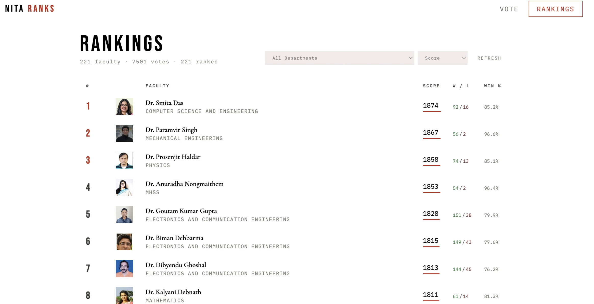
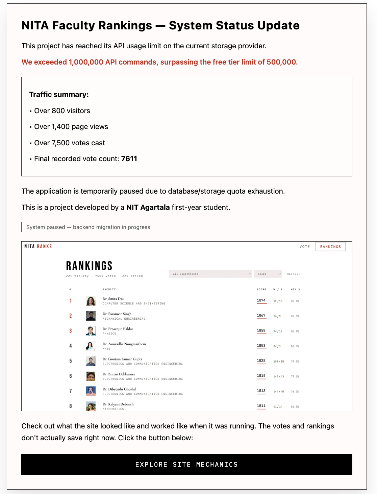
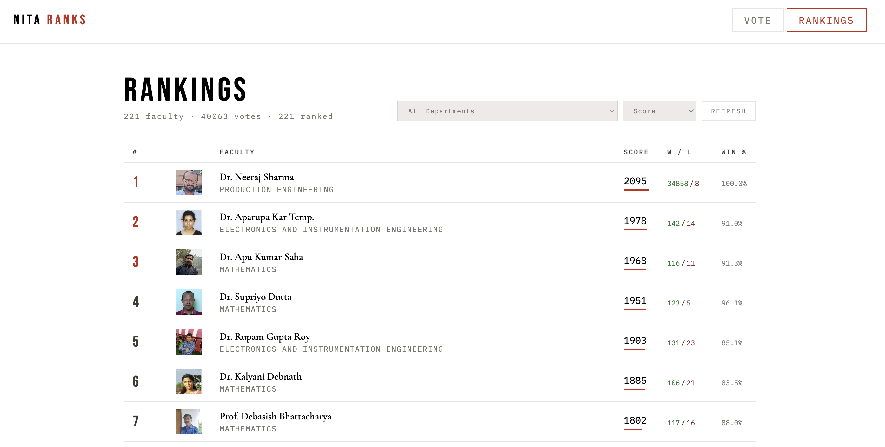
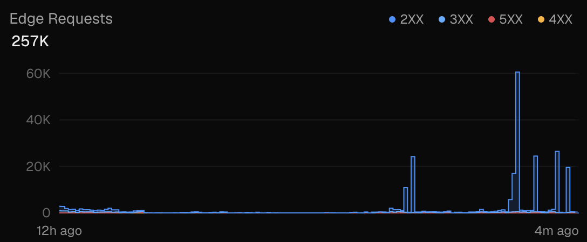
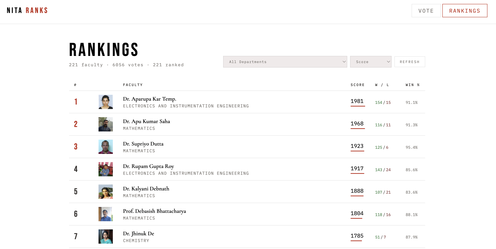

# NITA Ranks

An experimental pairwise ranking system for faculty members at NIT Agartala that was deployed, got 850+ visitors, generated 11,000+ votes, exhausted its infrastructure limits, was fixed and redeployed, and got hit with 275,000+ automated vote manipulation attempts, all within 24 hours of deployment.  

What began as a small campus experiment rapidly evolved into a live stress test of ranking algorithms, edge infrastructure, engagement dynamics, and adversarial behavior under real-world conditions.  

Check it out <a href="https://nita-ranks.vercel.app/">here</a>.

## What This Is
NITA Ranks is a lightweight experimental system for generating global rankings from local comparisons.
Instead of asking users to assign scores or ratings, the system repeatedly presents two faculty members at a time. Users select one. Over time, these binary decisions accumulate into a statistically meaningful ordering.
No explicit scoring is ever provided by the user. The ranking emerges entirely from interaction dynamics.

## Core Idea
Each faculty member is treated as a node in a competitive system. Every vote is a directed comparison: **A vs B → one wins, one loses.** 

From this, a global ordering emerges using an Elo-style rating system.

## Engagement Behavior (in 22 hours of site being live: May 23, 10:45 PM - May 24, 9 PM)  

- Unique visitors: 863  
- Total page views: 1,534 
- Total direct social impressions: 1,200+
- Total votes: 13,667+  
- Votes per visitor: ~16    
- Votes per page view: ~9  
- Edge requests: 125,000  

## Ranking System (Elo Model)
Each faculty member starts at a neutral baseline:
$$R_0 = 1500$$

When two faculty members are compared, the expected score for A is:  
$$\displaystyle E_A = \frac{1}{1 + 10^{\frac{R_B - R_A}{400}}}$$  

After the outcome, ratings update as:  
$$R'_A = R_A + K(1 - E_A)$$  
$$R'_B = R_B + K(0 - (1 - E_A))$$

Where $K = 32$. The system does not include any additional corrections such as decay, priors, or smoothing. Each update is independent, and the long-term structure emerges purely from repeated application of this rule.

## System Architecture
The project is split into two edge endpoints.

### 1. Vote Endpoint (`/api/vote`)
*   Accepts winner and loser IDs.
*   Fetches current scores from KV store, computes Elo update, and writes back state.
*   **Philosophy:** Each vote triggers: `SET score`, `INCR wins`, `INCR losses`, `INCR total_votes`. There is no batching, no queuing system, and no transactional layer. The design assumes that write operations should remain simple and stateless, even if this introduces eventual consistency instead of strict consistency.

### 2. Rankings Endpoint (`/api/rankings`)
*   Accepts `n` (faculty count).
*   Pulls all scores via KV pipeline and reconstructs ranking snapshot server-side.
*   **Philosophy:** The system does not cache precomputed rankings. Instead, it reconstructs the ranking dynamically from stored primitive values each time it is requested. This keeps the system transparent and easy to reason about, while increasing read overhead.

### Data Model
*   The underlying data model is intentionally minimal. Each faculty member is represented using three key-value entries:
*   **Per Faculty:** `score:<id>`, `wins:<id>`, `losses:<id>`.
*   **Global:** `total_votes`.
*   All higher-level structure is derived at read time from these primitives.
*   *Note: Faculty metadata such as name, department, and image is stored in a separate faculty.json file. This file is not included in the repository because it is being reused as a base dataset for other experiments built on top of the same comparison system.*

## UI Behavior
The frontend is built for speed:
*   Rapid pairwise voting with keyboard support (← / → / space).
*   **Optimistic updates:** The system uses optimistic updates, meaning the UI reflects the result of a vote immediately without waiting for confirmation from the server. This design choice is based on the assumption that perceived latency is more disruptive to user experience than temporary inconsistencies in state.

## Scale Event and System Reset
### Phase 1 — Initial Deployment
The system was initially deployed as a small-scale campus experiment but experienced significantly higher-than-expected interaction volume. Key metrics during this phase:  

| Metric | value |
| :--- | :--- |
| **Launch Timeline** | May 23, 10:45 PM – May 24, 12:00 PM |
| **Unique Visitors** | 700+ |
| **Page Views** | 1,200+ |
| **Total Votes Cast** | 7,611 |
| **Edge Requests** | 67,000+ |
| **API Operations** | 1,000,000+ (Limit Exhausted) |

### Phase 2 — API Requests Limited

The operation count scaled disproportionately because rankings refresh triggered N×3 KV reads per request, and each vote also expanded into multiple atomic writes, creating significant read/write amplification relative to actual vote count.  The site was shut down for 5 hours.

### Phase 3 — Reset + Redeployment
Following infrastructure constraints and API storage limitations, the system was redeployed with an updated Upstash Redis configuration within 5 hours of the first error.
This redeployment introduced a clean state reset. Prior vote history and rankings were not migrated.
All current rankings are therefore computed from a fresh dataset under the same Elo model, ensuring consistency and correctness within the active deployment. The system design remains unchanged in principle, but operates on a newly initialized state. Key metrics during this phase:  

| Metric | value |
| :--- | :--- |
| **Launch Timeline** | May 24, 5:45 PM – May 24, 9:00 PM |
| **Unique Visitors** | 150+ |
| **Page Views** | 300+ |
| **Total Votes Cast** | 6,056 |
| **Edge Requests** | 58,000+ |

### Phase 4 — Bot Attempts and Vote Manipulation

Shortly after deployment, the system became the target of an automated bot attack, which flooded the /api/vote endpoint with approximately 275,000 requests in a 90-minute window. The bot targetted the votes for one particular faculty member which increased their vote count to over 40,000.
Due to the Elo rating formula, the targeted faculty member’s score was mathematically capped, rendering the bot’s efforts to inflate the leaderboard ineffective. The ranking system proved self-correcting against artificial input.

### Phase 5 — Website Archived
Following the adversarial events of Phase 4, the platform has reached its natural conclusion. To preserve the system’s integrity as a historical artifact of campus dynamics, the infrastructure has been transitioned to a permanent, read-only state.

- The write-path (`/api/vote`) has been permanently disabled via an access gate, effectively freezing the dataset. The leaderboard now functions as an immutable snapshot.
- The bot-inflated metrics were normalized to remove extreme statistical outliers while preserving the integrity of the remaining dataset.

**Current Status:** Development of NITA Ranks has concluded. The repository and project is archived and no further infrastructure maintenance, moderation, or system updates are planned. All deployed endpoints and further votings or ranking manipulations should be considered unsupported.

**NOTE:** This project was built independently as an experimental systems exercise and is not affiliated with or endorsed by the National Institute of Technology Agartala. Rankings are generated entirely from anonymous pairwise interactions and should not be interpreted as formal evaluation.
