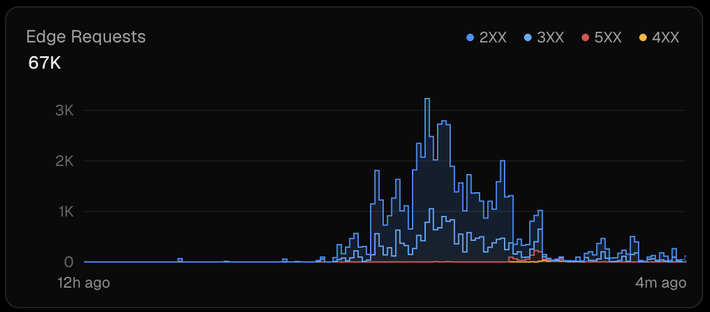

# NITA Ranks

A fast, interactive way to compare and rank faculty members on campus. Check it out <a href="https://nita-ranks.vercel.app/">here</a>.

---

## What This Is
This project is a lightweight campus system built around a very simple interaction model: two names are shown at a time, and the user chooses one. This process is repeated continuously, and over time these individual decisions accumulate into a global ranking of faculty members.

The key idea is that nothing is directly rated or manually scored. Instead, the system relies entirely on repeated pairwise comparisons, and the ranking emerges from those comparisons as a statistical consequence of interaction.

## Core Idea
Each faculty member is treated as a node in a competitive system. Every vote is a directed comparison: **A vs B → one wins, one loses.** 

From this, a global ordering emerges using an Elo-style rating system.

## Engagement Behavior

- Unique visitors: 800+  
- Total page views: 1,400+  
- Total direct social impressions: ~390
- Effective amplification factor: ~2×  
- Total votes: 7,611  
- Votes per visitor: ~10  
- Votes per page view: ~6
- Edge requests: 67,000+  

## Ranking System (Elo Model)
Each faculty member starts at a neutral baseline:
$$R_0 = 1500$$

When two faculty members are compared, the expected score for A is:  
$$\displaystyle E_A = \frac{1}{1 + 10^{\frac{R_B - R_A}{400}}}$$  

After the outcome, ratings update as:  
$$R'_A = R_A + K(1 - E_A)$$  
$$R'_B = R_B + K(0 - (1 - E_A))$$

Where $K = 32$. The system does not include any additional corrections such as decay, priors, or smoothing. Each update is independent, and the long-term structure emerges purely from repeated application of this rule.

## System Architecture
The project is split into two edge endpoints.

### 1. Vote Endpoint (`/api/vote`)
*   Accepts winner and loser IDs.
*   Fetches current scores from KV store, computes Elo update, and writes back state.
*   **Philosophy:** Each vote triggers: `SET score`, `INCR wins`, `INCR losses`, `INCR total_votes`. There is no batching, no queuing system, and no transactional layer. The design assumes that write operations should remain simple and stateless, even if this introduces eventual consistency instead of strict consistency.

### 2. Rankings Endpoint (`/api/rankings`)
*   Accepts `n` (faculty count).
*   Pulls all scores via KV pipeline and reconstructs ranking snapshot server-side.
*   **Philosophy:** The system does not cache precomputed rankings. Instead, it reconstructs the ranking dynamically from stored primitive values each time it is requested. This keeps the system transparent and easy to reason about, while increasing read overhead.

### Data Model
*   The underlying data model is intentionally minimal. Each faculty member is represented using three key-value entries:
*   **Per Faculty:** `score:<id>`, `wins:<id>`, `losses:<id>`.
*   **Global:** `total_votes`.
*   All higher-level structure is derived at read time from these primitives.
*   *Note: Faculty metadata such as name, department, and image is stored in a separate faculty.json file. This file is not included in the repository because it is being reused as a base dataset for other experiments built on top of the same comparison system.*

## UI Behavior
The frontend is built for speed:
*   Rapid pairwise voting with keyboard support (← / → / space).
*   **Optimistic updates:** The system uses optimistic updates, meaning the UI reflects the result of a vote immediately without waiting for confirmation from the server. This design choice is based on the assumption that perceived latency is more disruptive to user experience than temporary inconsistencies in state.

## Post-Mortem: Scale & Failure
Although originally intended as a small campus experiment, the system briefly operated at a significantly higher load than expected.

| Metric | value |
| :--- | :--- |
| **Launch Timeline** | May 23, 10:45 PM – May 24, 12:00 PM |
| **Unique Visitors** | 800+ |
| **Page Views** | 1,400+ |
| **Total Votes Cast** | 7,611 |
| **Edge Requests** | 67,000+ |
| **API Operations** | 1,000,000+ (Limit Exhausted) |

**The Failure:** The operation count scaled disproportionately because rankings refresh triggered N×3 KV reads per request, and each vote also expanded into multiple atomic writes, creating significant read/write amplification relative to actual vote count.  

